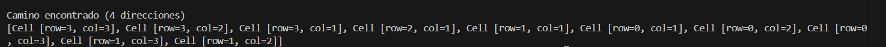

# 🧠 PRÁCTICA DE LABERINTO Y FIBONACCI EN JAVA

**Autor:** Andrés Cajas  
**Tema:** Resolución de Laberintos y Cálculo de Fibonacci usando Recursión y Programación Dinámica  
**Profesor:** Ing. Pablo Torres  
**Fecha:** 16/07/2025  
**Carrera:** Computación

---

## 📌 Objetivo

Demostrar el uso práctico y conceptual de recursión en Java mediante la resolución de laberintos en diferentes direcciones y la comparación de eficiencia en el cálculo de la serie de Fibonacci usando recursión básica y programación dinámica.

---

## 🗂️ Paquetes y Clases

### ✅ Laberinto
- **`App`**: Clase principal que ejecuta y compara los métodos del laberinto y Fibonacci.
- **`Cell`**: Modelo que representa una celda (posición) dentro del laberinto mediante filas y columnas.
- **`Maze`**: Clase encargada de almacenar la matriz del laberinto, con caminos libres y bloqueos, incluyendo método `printMaze()` para su impresión visual.
- **`MazeSolverRecursive`**: Implementa la lógica recursiva para buscar caminos en **dos direcciones** (abajo y derecha).
- **`MazeSolverCompleto`**: Implementa la lógica recursiva para buscar caminos en **cuatro direcciones** (abajo, derecha, arriba, izquierda).

### ✅ Fibonacci
- **`EjercicioPD`**: Clase que permite calcular el número de Fibonacci con:
    - Recursión básica (`getFibonaci(int n)`)
    - Programación dinámica usando cacheo (`getFibonaciPD(int n)`).

---

## ⚙️ Explicación de Métodos Clave

### 🔷 Laberinto
- `printMaze()`: Muestra el laberinto usando `-` para celdas libres y `*` para bloqueadas.
- `getPath()`: Busca un camino desde el punto inicial hasta el punto final usando recursión.
- Comparación directa entre un recorrido **limitado** (2 direcciones) y uno **completo** (4 direcciones).

### 🔷 Fibonacci
- `getFibonaci(int n)`: Implementación recursiva simple, mostrando el problema del crecimiento exponencial.
- `getFibonaciPD(int n)`: Implementación eficiente usando `HashMap` para cachear resultados, mejorando el tiempo de ejecución significativamente.

---

## ✅ Resultados de Ejecución

### 🟢 Resultado: Fibonacci con y sin Programación Dinámica

Se evidencia cómo el uso de programación dinámica reduce el tiempo de cálculo frente a la versión recursiva simple.

### 🟢 Resultado: Laberinto con 2 Direcciones

Cuando se utiliza únicamente dos direcciones (abajo y derecha), el laberinto no siempre encuentra solución dependiendo del camino bloqueado.

### 🟢 Resultado: Laberinto con 4 Direcciones

Con cuatro direcciones se logra mayor eficiencia y posibilidad de llegar al destino a pesar de obstáculos intermedios.

---

## 🏁 Instrucciones para Ejecución

1. Compilar el proyecto desde cualquier IDE compatible con Java (IntelliJ IDEA, Eclipse, NetBeans).
2. Ejecutar `App.java`.
3. Revisar la consola para visualizar los caminos encontrados y el rendimiento de Fibonacci.

---

## 📌 Conclusión Final

✅ El proyecto permite observar de manera práctica:
- Diferencias entre recursión simple y optimizada.
- La importancia de la programación dinámica.
- Comparativa clara del recorrido de laberintos usando dos o cuatro direcciones.
- Demostración gráfica mediante capturas de consola.

