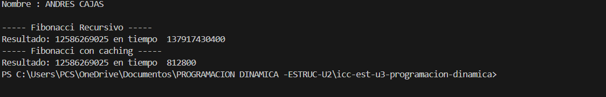

## Resultados de Ejecución



# 📌 Programación Dinámica y Laberinto 

Este proyecto contiene dos ejercicios principales usando **Java**:

1. **Fibonacci**: Cálculo recursivo y con programación dinámica (memoización) para demostrar la diferencia de rendimiento.
2. **Laberinto**: Implementación básica de un laberinto usando matrices booleanas.

---

**Autor:** Andrés Cajas  

**Tema:** Colecciones Java - Implementación de `Set` con sus distintas variantes

**Profesor:** Ing.Pablo Torres

**Fecha:** 21/07/2025

**Carrera :** Computacion


---

## 📁 Estructura del Proyecto

```
│
├── EjercicioPD.java          # Fibonacci recursivo vs memoización (Programación Dinámica)
├── Maze.java                 # Clase para imprimir laberinto
├── MazeSolver.java           # Interfaz para futuros algoritmos de resolución de laberinto
├── Cell.java                 # Clase auxiliar para coordenadas en el laberinto
└── App.java                  # Clase principal con main()
```

---

## 📝 Ejercicio 1: Fibonacci

### 📌 Descripción

El primer ejercicio demuestra cómo calcular números de Fibonacci de dos maneras:
- **Recursiva básica** (`getFibonacci`) - muy lenta para valores grandes.
- **Con Programación Dinámica (Memoización)** (`getFibonacciPD`) - mucho más rápida gracias al uso de caché.


---

## 📝 Ejercicio 2: Laberinto

### 📌 Descripción

Se imprime un laberinto sencillo en consola mediante una matriz de `boolean`:
- `true` → camino libre
- `false` → obstáculo

Ejemplo:
```
Laberinto Cargado
O O O O 
O O O O 
O X X O 
O O O O 
```
**Nota:** `O` representa camino, `X` representa obstáculo.

### 📝 Interfaz MazeSolver

Se incluye una interfaz `MazeSolver` para futuras implementaciones de algoritmos de búsqueda como BFS o DFS para encontrar caminos en el laberinto.

---

## 🚀 Ejecución

Compila y ejecuta con:

```bash
javac *.java
java App
```

---

## ✅ Recomendaciones

- Puedes ampliar este proyecto implementando algoritmos como BFS o DFS en `MazeSolver`.
- Para pruebas de rendimiento del Fibonacci, puedes probar con diferentes valores (`30`, `50`, `70`).

---

## 📚 Temas prácticos aplicados

- Programación Dinámica 🧮
- Algoritmos recursivos
- Laberintos y representación en matrices
- Buenas prácticas en OOP (POO) 🧑‍💻

